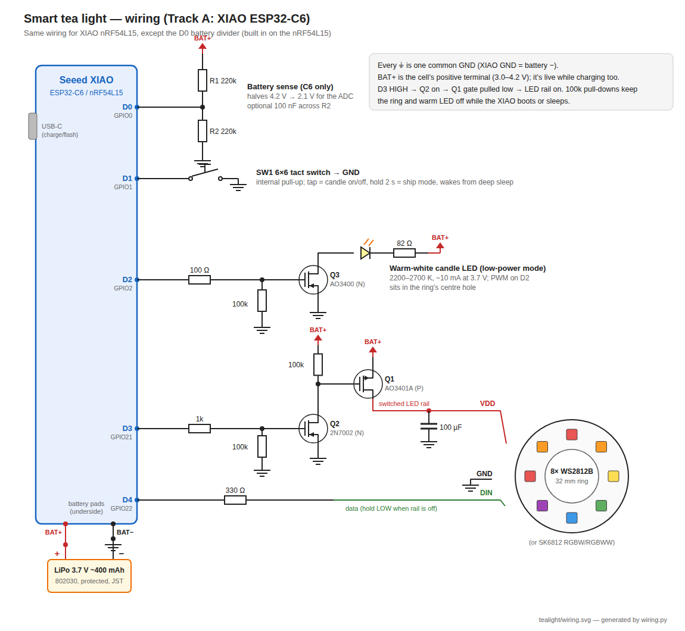

# smart-tealight

A rechargeable, 38 mm tea-light replacement with addressable LEDs, built on a
Seeed XIAO module, controlled from Home Assistant.

* **Fits a standard tea-light holder:** 38 mm Ø, ≤ 23 mm tall, 3D-printed PETG body
* **Battery powered:** ~400 mAh LiPo, charged over the XIAO's USB-C
* **Two light channels:** an 8-LED addressable ring for effects, and a single
  warm-white LED for a low-power flickering "candle" mode that lasts a week
* **Two firmware tracks on the same hardware:**
  * *Track A* — XIAO ESP32-C6 + [ESPHome](esphome/tealight-c6.yaml). Quick to
    build, ~½ day on battery because Wi-Fi stays associated. For prototyping.
  * *Track B* — the same XIAO ESP32-C6 + [ESP-Matter](https://github.com/espressif/esp-matter),
    Matter over Thread as a sleepy end device. Weeks of standby. The real
    device. (Not started yet.) A XIAO nRF54L15 + Zephyr port is a stretch option.

**Status: design stage.** No hardware has been built; all current and battery
figures are estimates to be measured on the first prototype.

## Docs

* [Design notes](docs/design-notes.md) — prior art, power budget, mechanical
  stack, pin plan, bill of materials (Amazon US), firmware behaviour, next steps
* [Shopping list](docs/shopping-list.md) — Amazon US listings for every part
* [Wiring schematic](docs/wiring.svg) and [perfboard layout](docs/perfboard.svg) (generators alongside)



## Repo layout

```
docs/       design notes, schematic and its generator
esphome/    Track A ESPHome config (XIAO ESP32-C6)
firmware/   Track B Zephyr / Matter firmware (to come)
hardware/   3D-printable body, later a custom LED PCB (to come)
```

## License

MIT — see [LICENSE](LICENSE).
