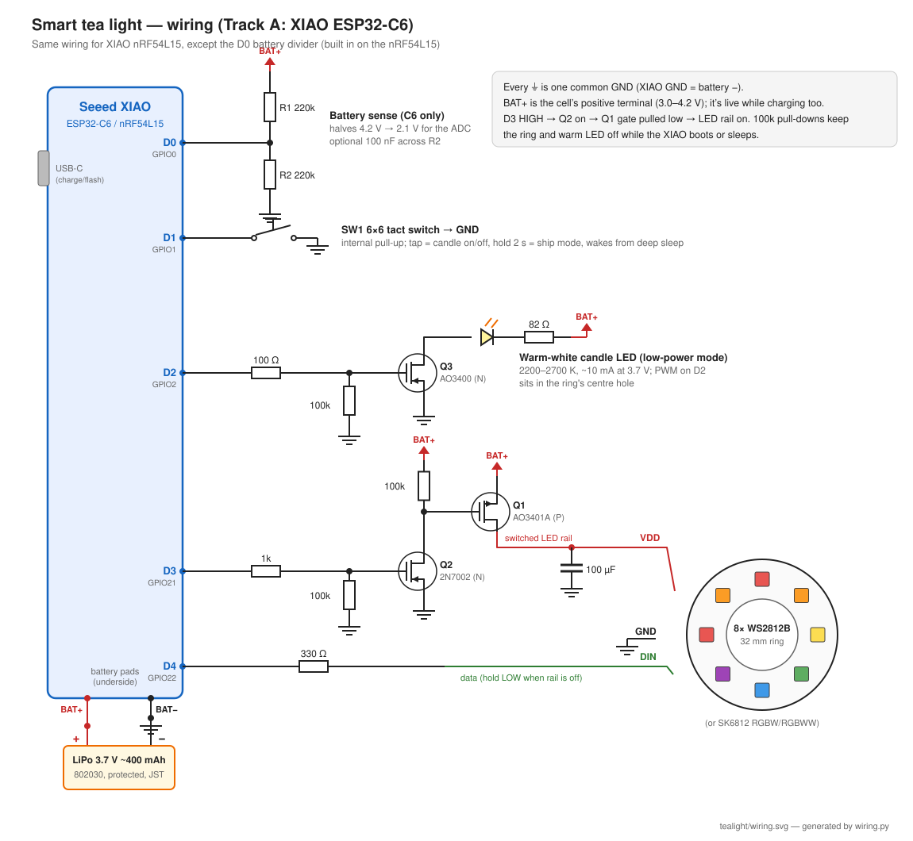
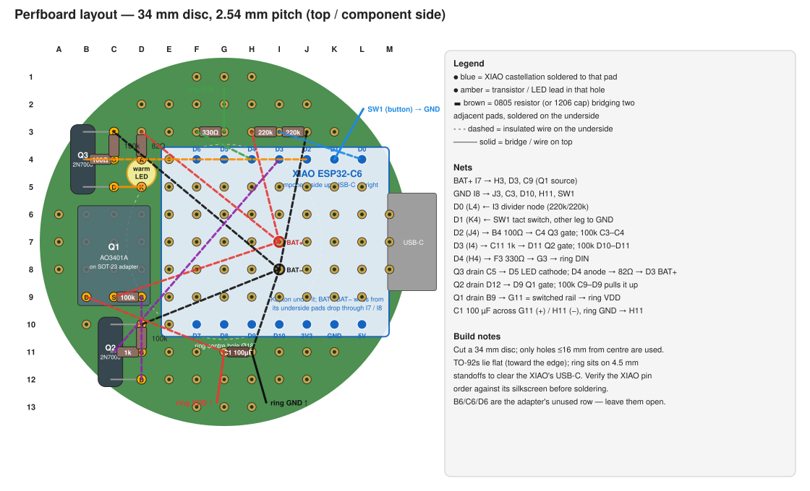

# Smart tea light — design notes

A 38 mm tea-light replacement: rechargeable, addressable RGB + warm white,
3D-printed body, controlled from Home Assistant singly or as a group.

Status: **design / pre-prototype** (2026-09-26). No hardware built yet. Every
current and runtime figure below is an estimate to confirm with a meter (a
Nordic PPK2 or a USB power meter on the charge port) on the first prototype.

## 1. Prior art — nothing does all of this yet

| Project | What it is | Why it isn't the answer |
|---|---|---|
| [PixelTheater/espcandle-demo](https://github.com/PixelTheater/espcandle-demo) | 38.6 × 20 mm custom PCB stack, ESP32-S3, 20× WS2812 + 2700 K white + red + UV, ESPHome, MIT | **No battery** — USB-C or 6–20 V DC in. Best reference for the LED layout and the ESPHome config |
| [3ative/Smart-Candles](https://github.com/3ative/Smart-Candles) | D1 Mini (ESP8266) wired into store-bought LED candles, ESPHome | Mains-powered via a phone charger, single-colour |
| [rhannink/XIAO-ESP32C6-Zigbee-WS2812B](https://github.com/rhannink/XIAO-ESP32C6-Zigbee-WS2812B) | XIAO ESP32-C6 as a Zigbee colour light over 16 WS2812B | Arduino, not a tea light, mains-powered. Shows the C6 → ZHA light path works |
| [Nordic Matter light bulb sample](https://docs.nordicsemi.com/bundle/ncs-latest/page/nrf/samples/matter/light_bulb/README.html) | Matter-over-Thread light, builds for `nrf54l15dk` | Starting point for the nRF firmware, not a product |

**Conclusion: start our own project.** Nobody has published a battery,
tea-light-sized, HA-integrated addressable light.

## 2. The one hard constraint: "a week on battery" vs Wi-Fi

This drives the whole design, so it comes first.

* The battery that fits is roughly **300–400 mAh** (see §4).
* An ESP32-C6 running ESPHome keeps Wi-Fi associated so HA can reach it.
  Even with `power_save_mode: LIGHT` that costs something like **20–40 mA
  all the time, lit or not.** 400 mAh ÷ 30 mA ≈ **13 hours.** No LED mode
  fixes that — the radio drains the battery on its own.
* An nRF54L15 as a **Thread sleepy end device** (Matter over Thread) polls
  its parent every ~0.5–1 s and averages tens of µA. Standby for a week
  costs ~10–20 mAh. **That's the only way to get "always reachable from HA"
  and "a week on a charge" at this size.**

Your HA already has what the Thread path needs: the **Matter** and
**OpenThread Border Router** integrations are loaded, plus the Thread
integration.

### Update 2026-09-26: the ESP32-C6 can do Matter over Thread too

The C6 has an 802.15.4 radio, so the same XIAO ESP32-C6 can run
**Matter over Thread as a sleepy end device** using Espressif's
[ESP-Matter SDK](https://github.com/espressif/esp-matter) (ESP-IDF, C/C++;
not ESPHome, which has no Matter support and no Zigbee `light`). Measured
standby for a tuned Matter light is ~50 µA average
([tomasmcguinness](https://tomasmcguinness.com/2025/01/06/lowering-power-consumption-in-esp32-c6/)),
~230 µA untuned — ≤40 mAh/week, so the week-long goal holds. Espressif's SED
support is younger than Nordic's
([esp-matter #478](https://github.com/espressif/esp-matter/issues/478)).

**Revised plan: one board.** Track A stays ESPHome/Wi-Fi on the C6 for the
prototype; Track B becomes ESP-Matter on the *same* C6 — no module swap. The
nRF54L15 is now a stretch option (3–5× lower sleep floor, more mature Matter
stack), not a requirement. The two-track table below is kept for reference.

### Recommendation: two tracks, one hardware design

The XIAO boards share one footprint and pinout, so the body, LED board and
wiring are identical. Only the module and firmware change.

| | Track A — prototype | Track B — the real device |
|---|---|---|
| Module | XIAO ESP32-C6 | **XIAO nRF54L15** |
| Firmware | ESPHome (starter config in [`esphome/tealight-c6.yaml`](../esphome/tealight-c6.yaml)) | Zephyr / nRF Connect SDK, Matter over Thread, sleepy end device |
| HA integration | ESPHome API over Wi-Fi | Matter (via your OTBR) |
| Standby life | ~½ day | weeks |
| Effects | ESPHome built-ins, no code | Written in C (flicker, rainbow, etc.) and picked through a Matter *Mode Select* endpoint → HA `select` entity |
| OTA | ESPHome OTA over Wi-Fi | MCUboot + SMP over BLE (nRF Connect Device Manager app); Matter OTA later |
| USB flash | yes | yes — the XIAO nRF54L15 has an on-board debug probe on USB-C |
| Why | Tests the LEDs, body, battery and effects in an afternoon | Meets the battery goal |

Build Track A first to sort out the physical design, then swap modules.

**If the XIAO nRF54L15 isn't in stock:** the **XIAO nRF52840** (widely stocked on
Amazon US, ~$10) does the same job. Nordic supports Matter over Thread on the
nRF52840 in NCS, and the XIAO's 2 MB QSPI flash (P25Q16H) covers the external
flash Matter DFU needs — the NCS lighting sample needs a board overlay for it
(see [Nordic DevZone: Matter with XIAO nRF52840](https://devzone.nordicsemi.com/f/nordic-q-a/97985/matter-with-seed-xiao-nrf52840)
and [felix920506/nrf52840-battery-button](https://github.com/felix920506/nrf52840-battery-button),
a battery Matter-over-Thread device on exactly this board). Costs vs the
nRF54L15: ~2× the sleep current (still tens of µA — irrelevant next to the
LEDs), no built-in battery sense (so keep the D0 divider), and an older, larger
SoC, with 1 MB internal flash that Matter fills most of.

**Ruled out for now:** ESPHome on nRF52/XIAO nRF52840. ESPHome's nRF52 port
has no native HA API (no Wi-Fi), and its Zigbee component (added in 2026.1)
exposes only binary_sensor, sensor, switch and number — **no `light`**. Worth
checking again later; it would give ESPHome YAML with Zigbee battery life.

## 3. Power budget (estimates)

Usable capacity is ~340 mAh from a 400 mAh cell (stopping at 3.5 V).

| State | Draw | Hours from 340 mAh |
|---|---|---|
| nRF54L15, Thread SED standby, LED rail **off** | ~0.05–0.1 mA | months |
| ESP32-C6, Wi-Fi associated, LEDs off | ~20–40 mA | ~10–15 h |
| Addressable LEDs powered but **black** | ~0.6–1 mA **per LED** | — (why the LED rail must be switched off) |
| **Low-power candle mode**: one warm-white LED, PWM flicker, ring rail off (nRF) | ~3–5 mA | **~70–100 h** |
| 8× SK6812 warm, ~10 % brightness (nRF) | ~15–25 mA | ~15–20 h |
| 8× SK6812 full white | ~400+ mA | beyond what the cell can supply — **cap brightness in firmware** |

So "a week" on the nRF track is about **10 h/day of candle mode** or **2–3 h/day
of addressable effects**. That's what the fixed-colour low-power mode is for.

Two design rules follow:

1. **Switch the addressable LEDs' power off** whenever they're dark (a
   high-side MOSFET, §5). WS2812/SK6812 chips draw 0.6–1 mA each just being
   powered. 8 LEDs on a live rail would use up a week's standby budget in a day.
2. **Cap brightness** in firmware (ESPHome `color_correct`) so a full-white
   command can't pull more than the cell or the XIAO charger can take.

## 4. Mechanical stack (38 mm Ø, ≤ 23 mm)

Walls 1.0 mm → **36 mm usable inner diameter**.

```
 z (mm)
 23 ┬─ diffuser dome top (1 mm translucent PETG)
    │  air gap ~3–4 mm (helps diffusion)
 18 ├─ LED board: 32 mm 8-LED ring, or a 144/m strip segment  (~3.5)
 14 ├─ wiring + MOSFETs on a small perfboard / SOT-23 adapters (~1.5)
 13 ├─ XIAO module, USB-C at the side wall                      (~4.0)
  9 ├─ LiPo 802030 (8 × 20 × 30 mm) + 0.5 mm swell room         (~8.5)
  1 ├─ floor (0.8–1 mm) + button / slide switch opening
  0 ┴
```

* **Battery footprint:** 20 × 30 mm has a 36.1 mm diagonal, so it only just
  fits a 36 mm bore (pouch corners are rounded, but test-print first).
  Fallbacks: **602030** (6 mm, ~300 mAh, frees 2 mm) or a **25 × 25** cell.
  Get cells with a protection PCB and a JST-1.25 lead.
* **XIAO placement:** with a 17.8 mm wide board, the side wall is 15.6 mm from
  centre, so the board spans roughly +15.6 → −5.4 mm and the USB-C sticks out
  to a slot in the wall. Keep the antenna end clear of the battery and the LED
  board's copper.
* **Body:** two parts — a cup (PETG, matte black or white) and a snap-fit
  diffuser cap. PETG, not PLA: tea-light holders sit in sunny windows and next
  to real candles.
* **Diffuser:** *translucent* (natural) PETG looks better than *clear*. Clear
  shows every LED as a hotspot. Print the dome in vase mode, 0.8–1 mm. An
  optional flame-shaped insert over the centre LED looks convincing.

## 5. Electronics



Schematic: [`wiring.svg`](wiring.svg) (regenerate with `python3 wiring.py`).

### Pin plan (same XIAO positions for C6 and nRF54L15)

| XIAO pin | C6 GPIO | Use | Notes |
|---|---|---|---|
| D0 | GPIO0 | Battery sense (C6 only) | 2 × 220 kΩ divider BAT+ → D0 → GND. The C6 has no built-in battery sense. **The nRF54L15 has one built in** (load-switched), so leave D0 free there |
| D1 | GPIO1 | Push button to GND | An LP GPIO, so it can wake the C6 from deep sleep. Also: local toggle, and long-press for ship mode |
| D2 | GPIO2 | Warm-white LED PWM | Gate of a low-side N-FET (AO3400). LED + resistor from BAT+ |
| D3 | GPIO21 | Addressable LED rail enable | Drives the high-side switch below |
| — | GPIO3, GPIO14 | **Reserved: XIAO C6 RF switch** (not on the header) | GPIO3 low enables the antenna switch, GPIO14 low selects the onboard ceramic antenna. Firmware must drive both low before Wi-Fi/Thread starts or the radio sees nothing. Applies to ESP-Matter too |
| D4 | GPIO22 | Addressable LED data | 330 Ω series resistor. Drive it **low** whenever the rail is off, or the LEDs get phantom-powered through the data pin |

### LED rail switch

A P-FET alone won't work: at BAT = 4.2 V a 3.3 V GPIO can't pull the gate high
enough to switch it off. Use the standard two-transistor high-side switch:

```
BAT+ ──┬──────────── S  AO3401A (P-FET)  D ─────── LED ring VDD (+ 100 µF)
       │                 G
      100k               │
       └─────────────────┤
                         D  2N7002 (N-FET)
GPIO21 ── 1k ────────── G
                         S ── GND
```

### LEDs — pick one

| Option | Part (Amazon US search term) | Pros | Cons |
|---|---|---|---|
| **A. Off-the-shelf ring + centre warm LED** | "8 bit WS2812 5050 RGB LED ring" (32 mm OD / ~18 mm ID, e.g. Geekstory 2-pack) + a warm-white 2200–2700 K 3 mm or 5050 LED in the middle | No soldering of LED chips; centre hole is exactly where the candle LED goes | RGB only — whites from mixed RGB look bluish and cost 3× the current |
| **B. SK6812 RGBW(W) strip segment** | "SK6812 RGBW warm white 144 LEDs/m" (BTF-LIGHTING etc.) — cut 4 pixels (~28 mm) and lay them across the top, or 2 × 3 in a cross | True warm-white channel on every pixel; a 1 m reel makes a dozen candles | Rectangular layout; strip width ~10–12 mm |
| **C. Hand-built ring** | "SK6812RGBWW 5050 individually addressable chips" (100-pack) on a small custom PCB | Best result: RGB + warm white per pixel in a proper ring | Needs a PCB (JLCPCB, not Amazon) — a good v2 |

**Recommendation:** start with **A** (cheapest, fastest), keeping the separate
warm LED as the low-power candle channel. Move to **C** once the form factor
is settled. SK6812 / WS2812B are 5 V parts but run directly from a 3.5–4.2 V
cell: blue and white dim a little near empty, which the 3.5 V cutoff avoids.
3.3 V data meets V_IH (0.7 × 4.2 V = 2.94 V) even on a full cell.

### Bill of materials (Amazon US, per candle)

| Item | Search term | Notes |
|---|---|---|
| XIAO ESP32-C6 **or** XIAO nRF54L15 | "Seeed Studio XIAO ESP32C6", "Seeed XIAO nRF54L15" | Both have a LiPo charger and battery pads on the back |
| LiPo 3.7 V ~400 mAh, 802030 (or 602030) | "3.7V 400mAh 802030 lipo JST 1.25" | Needs a protection PCB |
| LED ring | "WS2812B 8 bit ring 32mm" | Or the SK6812 options above |
| Warm-white LED | "2200K warm white 3mm LED" or "5050 warm white SMD" | Candle channel |
| AO3401A, AO3400, 2N7002 MOSFETs | "SOT-23 MOSFET assortment" + "SOT-23 to DIP adapter" | Or one tiny load-switch breakout |
| Resistors 100 k, 220 k ×2, 1 k, 330 Ω, ~82 Ω | resistor kit | |
| 100 µF low-ESR cap | "100uF 6.3V tantalum" or ceramic 47 µF 0805 | Across the LED rail |
| 6 mm tact switch (or a tiny slide switch) | "6x6x3.1 tactile switch" | Bottom of the body |
| Filament | translucent (natural) PETG + black/white PETG | |

### Perfboard build (prototype)



[`perfboard.svg`](perfboard.svg) (generate with `python3 perfboard.py`) places
everything on a 34 mm disc cut from 2.54 mm double-sided perfboard (e.g. the
4 × 6 cm board from a Rindion 32-pack). Differences from the schematic, to
suit hand soldering:

* Q2 and Q3 are **2N7000** (TO-92, through-hole) instead of SOT-23 parts —
  only the P-FET Q1 needs a SOT-23 adapter. 2N7000 is fine here: Q3 carries
  10 mA, Q2 only pulls Q1's gate.
* Resistors and C1 are **0805 / 1206 SMD bridging adjacent pads** on the
  underside; 1/8 W axials standing on end also work.
* The XIAO is soldered flat by its castellations to pads F4–L4 / F10–L10 with
  Kapton tape underneath; BAT+/BAT− wires come off its underside pads and
  drop through I7 / I8, where the battery lead also lands. The XIAO's USB-C
  ends ~2 mm inside the wall, so the wall gets a recessed slot (magnetic
  USB-C tips help here).
* Height: floor 1 + cell 8.5 + perf 1.6 + XIAO 4 + ring on 4.5 mm standoffs
  3.5 + dome 1 ≈ 22 mm. Nothing to spare — TO-92s lie flat.

Once the prototype checks out, this becomes a two-layer 34 mm round PCB
(KiCad; JLCPCB/PCBWay) with the XIAO castellated onto it, SK6812 RGBWW
pixels in a ring, the MOSFETs as SOT-23s, and pogo/magnet charging pads.

## 6. Firmware behaviour (both tracks)

* **Two HA light entities per candle:** `Ring` (addressable RGB(W), effects)
  and `Candle` (warm LED, flicker effect = low-power mode). An automation or
  script can switch between them by battery level.
* **Group control:** add the candles to an HA light group (Helpers → Group →
  Light). Effects run locally on each candle, so they don't sync across
  candles. That doesn't matter for flicker (it's meant to look random) but
  would for chases — they'd need a shared trigger or Matter group multicast
  (v2).
* **Battery:** voltage + percentage sensors. Below 3.5 V, force the ring off
  and allow candle mode only. Below 3.4 V, shut down.
* **Ship / storage mode:** an HA button (and a long-press) puts the device
  into deep sleep / System OFF. Only the button wakes it.
* **nRF latency:** a sleepy end device only hears commands on its next poll.
  Use ~1 s polls while dark and switch to fast polling while lit — the LEDs
  dominate power then anyway.

## 7. Things not in the original list

1. **Charging a set of candles.** Plugging USB-C into ten candles a week gets
   old. Options: magnetic USB-C tips (cheap, one per candle), pogo pins on
   the base plus a printed charging tray, or a Qi receiver coil in the base
   (a 5 V Qi receiver ~30 mm fits under the battery if you give up ~1.5 mm of
   height or cell).
2. **A physical switch.** Real tea lights have one, and so should this one
   for storage and for guests with no HA access.
3. **LiPo safety.** Enclosed pouch cell, next to candle holders. Buy cells
   with protection, leave swell room, use PETG, don't charge unattended the
   first few times, and never put one in a holder with a real flame.
4. **Commissioning (nRF):** Matter pairs over BLE with a QR code. Print or
   label the QR/manual code on the base of each unit before you close it up.
5. **Charge indication.** Both XIAOs have a charge LED on the board; route
   light from it to the outside (a thin wall or a light pipe) so you can see
   when it's full.
6. **Unique naming.** Use ESPHome `name_add_mac_suffix` or per-unit
   substitutions, so one firmware image flashes every candle.

## 8. Next steps

- [ ] Order Track A parts + a XIAO nRF54L15 (or nRF52840 if the 54 isn't shipping)
- [ ] Print a fit-test body (CAD: OpenSCAD or build123d so it's parametric — cell size, ring OD, height)
- [ ] Bring up `esphome/tealight-c6.yaml`, measure real currents per mode
- [ ] Start the nRF firmware from NCS `samples/matter/light_bulb`, build as MTD/SED for `xiao_nrf54l15`, add WS2812 (SPI) driver + Mode Select endpoint
- [ ] Move to its own public GitHub repo once there's something to share (this notes repo is private)
